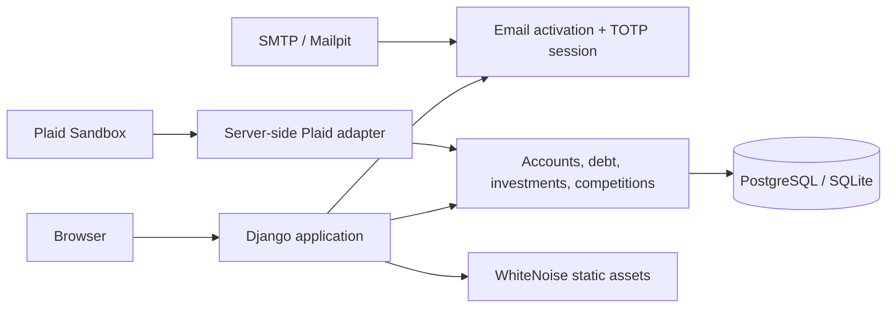

# Emvera

[](https://github.com/danieltalbert/emvera/actions/workflows/backend-ci.yml)

Emvera is a Django personal-finance engineering project that combines account aggregation, debt-planning tools, portfolio analysis, and virtual investing competitions. The current release is deliberately designed for **Plaid Sandbox and synthetic data**: it demonstrates the end-to-end data flow without connecting real financial accounts or placing real trades.

> **Project boundary:** Emvera is an educational prototype, not a bank, broker, or financial adviser. The shipping branch does not execute brokerage orders, process payments, or present predictive ML as a finished capability.

## Why this project exists

Financial applications are interesting because ordinary product choices become security and data-integrity choices. Emvera focuses on those seams:

- every financial row is scoped to its authenticated owner;
- password login and TOTP verification are separate authentication steps;
- email activation is required for new accounts;
- Plaid access tokens stay server-side and are encrypted at rest;
- CSV imports reject malformed, non-finite, out-of-range, and cross-user data;
- sandbox and synthetic fixtures keep the demonstration reproducible.

## Implemented capabilities

| Area | What is implemented | Demonstration mode |
| --- | --- | --- |
| Account data | Manual entry, validated CSV import, Plaid Link and transaction sync | Plaid Sandbox or synthetic CSV |
| Authentication | Email activation, password reset, confirmed TOTP setup, per-session OTP challenge | Local Mailpit and any authenticator app |
| Debt tools | Avalanche, snowball, custom payoff plans, reminders, credit-score history | Synthetic balances only |
| Investments | Holdings overview, projections, allocation comparison, rule-based recommendations | Synthetic holdings only |
| Competitions | Virtual portfolios, lobbies, rankings, and casual browser mini-games | No real orders or funds; scores are not anti-cheat validated |
| Operations | PostgreSQL, Gunicorn, WhiteNoise, Docker, readiness probes, deployment checks | Local container stack or a WSGI host |

Alpaca paper trading, payment processing, and predictive ML are roadmap items rather than features of this release. That distinction is intentional and documented in [the integrations guide](docs/INTEGRATIONS.md).

## Architecture



The detailed trust boundaries and data flow are in [docs/ARCHITECTURE.md](docs/ARCHITECTURE.md).

## Run locally

Prerequisites: Python 3.12 or 3.13 and Git.

```powershell
python -m venv .venv
.\.venv\Scripts\Activate.ps1
python -m pip install --upgrade pip
python -m pip install -r requirements.txt
Copy-Item .env.example .env
```

Set a fresh local `DJANGO_SECRET_KEY` in `.env`, then run:

```powershell
python manage.py migrate
python manage.py runserver
```

Open `http://127.0.0.1:8000/`. With debug mode enabled, verification messages use the console email backend unless SMTP is configured.

## Run the reproducible demo stack

Docker Compose starts Django, PostgreSQL, and Mailpit:

```powershell
docker compose up --build
```

- Application: `http://localhost:8000/`
- Mailpit inbox: `http://localhost:8025/`
- Liveness: `http://localhost:8000/healthz/`
- Database readiness: `http://localhost:8000/readyz/`

See [docs/DEMO.md](docs/DEMO.md) for the interview walkthrough and the optional Plaid Sandbox setup.
The current AWS recommendation and a deliberately limited Lightsail preview runbook are in [docs/AWS_DEPLOYMENT.md](docs/AWS_DEPLOYMENT.md).

## Verification

```powershell
$env:DJANGO_SECRET_KEY = 'local-test-key'
$env:DJANGO_ALLOWED_HOSTS = 'testserver,localhost,127.0.0.1'
python manage.py check
python manage.py makemigrations --check --dry-run
python manage.py test
python -m pip check
ruff format --check .
ruff check .
```

The current release suite contains 204 tests. CI repeats it against PostgreSQL on Python 3.12 and 3.13, builds manifest-backed static assets, runs Django's hardened deployment checks, compiles the source tree, and audits pinned dependencies.

## Repository guide

```text
accounts/           authentication, onboarding, email activation, and TOTP
data_integration/   manual/CSV ingestion and the Plaid Sandbox adapter
debt_management/    payoff strategies, reminders, and credit-score history
investments/        holdings analysis, projections, and recommendations
competition/        virtual portfolio competitions and mini-games
core/               settings, root routing, health probes, and deployment glue
templates/          shared and public HTML templates
static/             source CSS and browser assets
docs/               architecture, demo, deployment, and integration notes
```

## Security and production

Never commit `.env`, API credentials, access tokens, production data, or authenticator secrets. The deployment-specific settings and launch checklist are in [DEPLOYMENT.md](DEPLOYMENT.md); vulnerability reporting is covered by [SECURITY.md](SECURITY.md).

The repository is ready for a sandbox demonstration. A public launch still requires a real hosting target, managed secrets, SMTP credentials, a dedicated production database, monitoring, backups, and the explicit go-live review documented in the deployment guide.
