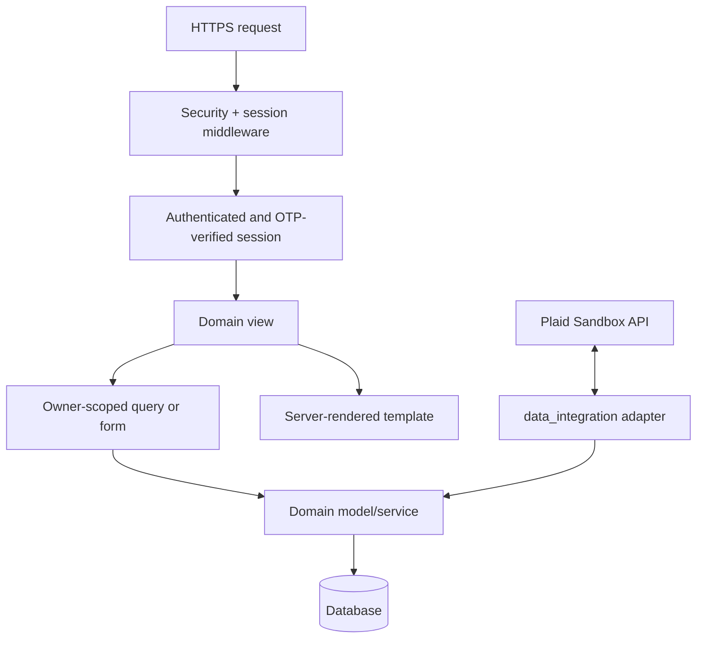

# Architecture

## System shape

Emvera is a server-rendered Django application. Domain apps own their models, views, forms, URLs, migrations, and focused tests. The browser receives HTML and small progressive-enhancement scripts; provider credentials and financial access tokens never belong in browser code.

## Trust boundaries

### Browser to Django

Django owns password validation, CSRF protection, session cookies, email activation, and TOTP verification. A correct password alone does not create an authenticated session for an account with a confirmed TOTP device. The short-lived pre-authentication state contains only the user identifier, intended destination, issue time, and attempt count.

### User to financial rows

Accounts are directly owned by a user. Transactions, investments, and debts are reached through an owner-scoped account. Views and import services must not accept a posted owner identifier. Plaid Item ownership is resolved before its access token or synchronized data can be updated.

### Django to Plaid

The browser receives only a short-lived Plaid Link token. The public token is exchanged server-side. The resulting access token is encrypted with a dedicated, rotatable Fernet key before persistence and is not serialized back to the browser, placed in logs, or rendered in templates. Versioned ciphertext can be decrypted with temporarily configured previous keys during a controlled rotation.

### Application to infrastructure

Configuration is environment-driven. PostgreSQL is selected through `DATABASE_URL`; SQLite is the local fallback. Static assets are collected into manifest-backed WhiteNoise storage outside development and tests. `/healthz/` reports process liveness, while `/readyz/` checks database availability without returning infrastructure details. An exact-path probe middleware serves only those two generic responses before HTTPS and Host-header enforcement so private container/target-group checks do not require a wildcard host policy.

## Application modules

| Module | Responsibility |
| --- | --- |
| `accounts` | Custom user, activation, authentication, TOTP, onboarding, profile |
| `data_integration` | Account/debt/transaction entry, CSV validation, Plaid synchronization |
| `debt_management` | Payoff strategies, reminders, consolidation heuristics, credit history |
| `investments` | Holdings views, projections, comparisons, and rule-based guidance |
| `competition` | Virtual competitions, participants, rankings, and mini-games |
| `core` | Settings, root routing, operational probes, shared test coverage |

## Known pre-public-launch decisions

- Reminder delivery needs a durable job runner, retry policy, and provider delivery-state model before real notifications are promised.
- Public authentication and email-triggering routes need a shared rate limiter rather than process-local protection.
- Browser mini-game scores are suitable for a casual virtual demo, not an adversarial ranking; authoritative scoring requires server-validated gameplay events.
- Production telemetry must redact financial values and user identifiers by policy, not convention alone.
- Live brokerage execution and payment processing are outside the supported release.
