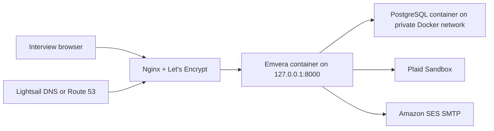

# AWS Hosting Decision and Sandbox Preview

Last reviewed: 2026-07-18

## Recommendation

Use a **2 GB Amazon Lightsail Linux instance** for the interview sandbox preview. Run the checked-in Docker image and PostgreSQL on that one VM, put Nginx and HTTPS in front of loopback-bound Gunicorn, take automatic snapshots, and keep all data synthetic. This is the smallest AWS setup that is easy to explain and inexpensive to discard.

Before accepting real users or real financial data, move the web container to **ECS Express Mode** and the database to private managed PostgreSQL. ECS Express Mode provisions Fargate, a load balancer with TLS, autoscaling, monitoring, and networking from the existing container image. App Runner is not a new-project option because AWS has closed it to new customers.

| Target | Approximate steady cost | Appropriate use |
| --- | ---: | --- |
| 2 GB Lightsail VM, app and PostgreSQL together | About $12/month plus snapshots, domain, and email | Interview sandbox only |
| 2 GB Lightsail VM plus encrypted managed Lightsail PostgreSQL | About $42/month plus domain and email | Stronger public preview |
| ECS Express Mode plus private RDS PostgreSQL | Roughly $55–85/month depending on task, load balancer, and database size | Real production architecture |

These are planning estimates, not quotes. Confirm the selected region and resources in the AWS Pricing Calculator before provisioning. Official references: [AWS Free Tier FAQ](https://aws.amazon.com/free/free-tier-faqs/), [Lightsail pricing](https://aws.amazon.com/lightsail/pricing/), [ECS Express Mode](https://docs.aws.amazon.com/AmazonECS/latest/developerguide/express-service-overview.html), [App Runner availability](https://docs.aws.amazon.com/apprunner/latest/dg/apprunner-availability-change.html), and [Route 53 pricing](https://aws.amazon.com/route53/pricing/).

## The current Free Tier is not a free first year

New AWS customers can receive up to $200 in credits, but the Free Plan ends after six months or when those credits are exhausted, whichever comes first. Credits expire 12 months after account creation. Lightsail currently advertises three months free on selected instance bundles, including the $12 plan. Do not design the deployment around permanent free usage.

## Preview topology



The repository's `compose.preview.yaml` does not include Mailpit and publishes no database port. The local `compose.yaml` binds both the web app and Mailpit to loopback; never expose Mailpit publicly because it contains activation and password-reset links.

## Provisioning checklist

1. Create a 2 GB Lightsail Linux instance in the region nearest the interviewer.
2. Attach a static IP. Open ports 80 and 443; restrict SSH to your IP when possible.
3. Add a billing budget and alerts before starting paid resources.
4. Install Docker Engine and the Compose plugin from Docker's official repository.
5. Clone this private repository with a read-only deploy key.
6. Create `.env.production` on the instance with owner-only permissions. Do not upload it to GitHub or paste it into chat.
7. Build and start the preview using the commands below.
8. Put Nginx in front of `127.0.0.1:8000`, obtain a certificate with Certbot, and only then enable the HTTPS settings.
9. Point the chosen domain or subdomain at the Lightsail static IP.
10. Verify activation email, password reset, TOTP, Plaid Sandbox, `/healthz/`, `/readyz/`, backups, and restore steps before sharing the URL.

## Required server environment

Create `.env.production` from this shape. Generate every secret locally and substitute the real hostname; the values below are placeholders.

```dotenv
DJANGO_SECRET_KEY=
DJANGO_DEBUG=False
DJANGO_ALLOWED_HOSTS=demo.example.com
DJANGO_CSRF_TRUSTED_ORIGINS=https://demo.example.com
DJANGO_TRUST_X_FORWARDED_PROTO=True
DJANGO_SECURE_SSL_REDIRECT=True
DJANGO_SESSION_COOKIE_SECURE=True
DJANGO_CSRF_COOKIE_SECURE=True
DJANGO_SECURE_HSTS_SECONDS=3600
DJANGO_SECURE_HSTS_INCLUDE_SUBDOMAINS=False
DJANGO_SECURE_HSTS_PRELOAD=False

POSTGRES_DB=emvera
POSTGRES_USER=emvera
POSTGRES_PASSWORD=
DATABASE_URL=postgresql://emvera:URL_ENCODED_PASSWORD@db:5432/emvera
DJANGO_DB_SSLMODE=disable

EMAIL_HOST=email-smtp.us-west-2.amazonaws.com
EMAIL_PORT=587
EMAIL_HOST_USER=
EMAIL_HOST_PASSWORD=
EMAIL_USE_TLS=True
EMAIL_USE_SSL=False
DEFAULT_FROM_EMAIL=Emvera <noreply@demo.example.com>
SERVER_EMAIL=Emvera Errors <errors@demo.example.com>

PLAID_CLIENT_ID=
PLAID_SECRET=
PLAID_ENV=sandbox
PLAID_PRODUCTS=transactions
PLAID_TOKEN_ENCRYPTION_KEY=

WEB_CONCURRENCY=2
LOG_LEVEL=INFO
```

`DJANGO_DB_SSLMODE=disable` is limited to the private, single-host Docker network in this preview file. A managed database must use `require`, `verify-ca`, or `verify-full`; the deployment system check rejects an unencrypted production database review.

Start and verify the preview:

```sh
docker compose --env-file .env.production -f compose.preview.yaml build
docker compose --env-file .env.production -f compose.preview.yaml run --rm web python manage.py migrate --noinput
docker compose --env-file .env.production -f compose.preview.yaml run --rm web python manage.py check
docker compose --env-file .env.production -f compose.preview.yaml up -d
docker compose --env-file .env.production -f compose.preview.yaml ps
curl http://127.0.0.1:8000/healthz/
```

The strict deployment check intentionally rejects the preview's unencrypted Docker-network database. For the one-host sandbox only, run all other checks and record that exception; do not waive it for a managed database or public launch.

## Email constraint for an interview demo

New SES accounts begin in the SES sandbox. They can send only to verified addresses or domains, with a maximum of 200 messages per day and one message per second. Either verify the exact demo recipient in advance, request SES production access, or seed a disposable verified demo account. Do not rely on an arbitrary interviewer email working on the day of the demo.

## Domain and HTTPS

Lightsail includes DNS management; Route 53 is also valid and currently charges $0.50 per hosted zone per month for the first 25 zones. Domain registration is a separate annual charge. For the Lightsail preview, an A record should point `demo.example.com` to the static IP. Nginx must forward `Host` and `X-Forwarded-Proto`; the application already trusts the latter only when explicitly enabled.

## Upgrade boundary

Move away from the single VM before real users or real financial data. The next architecture should have private managed PostgreSQL, automated backups and restore tests, IAM-managed secret injection, durable reminder jobs, shared authentication rate limits, centralized redacted telemetry, and an explicit privacy/retention/incident-response review.
