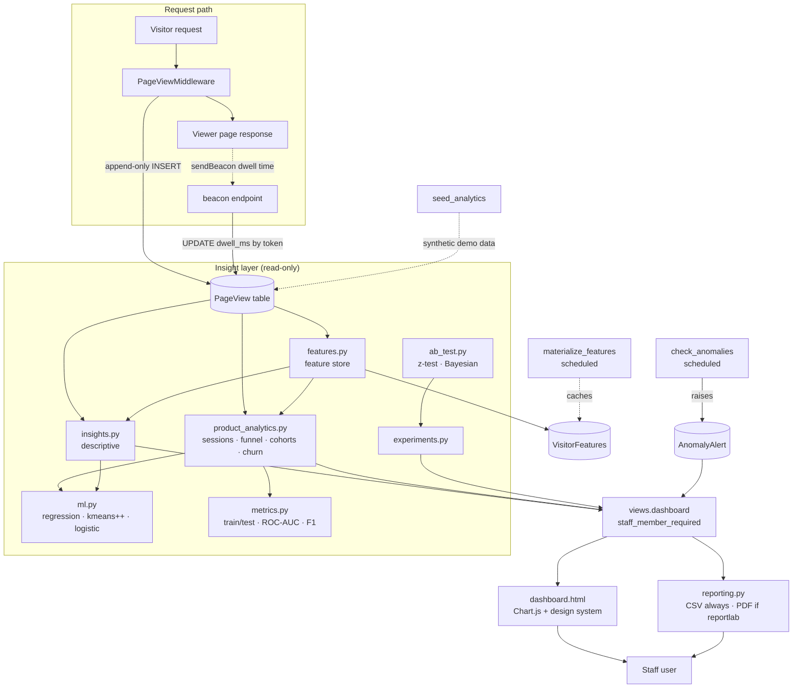
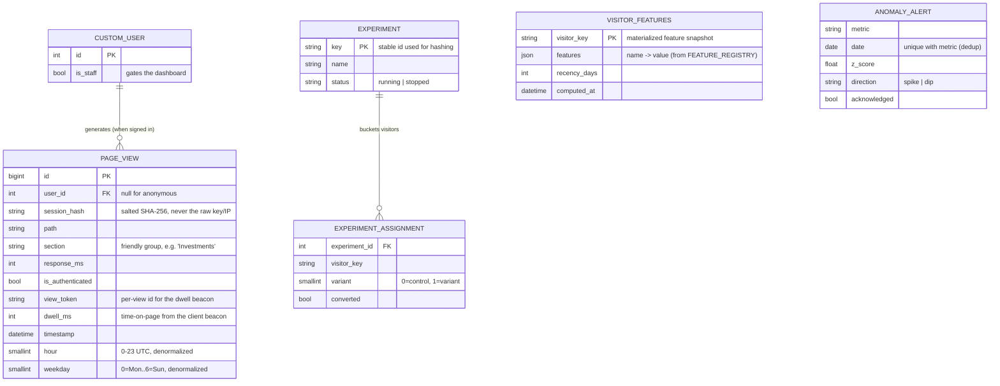
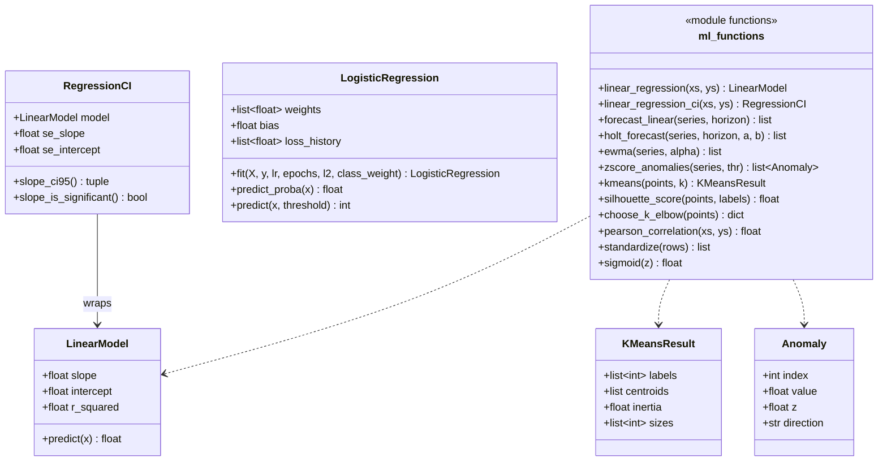
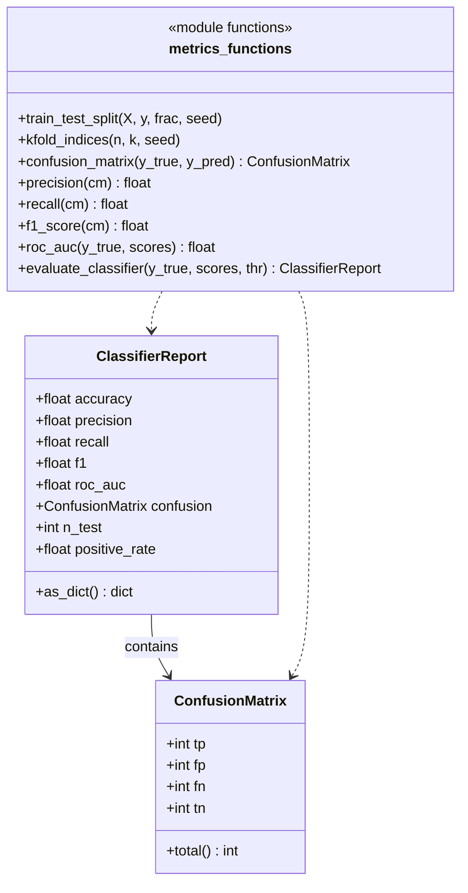
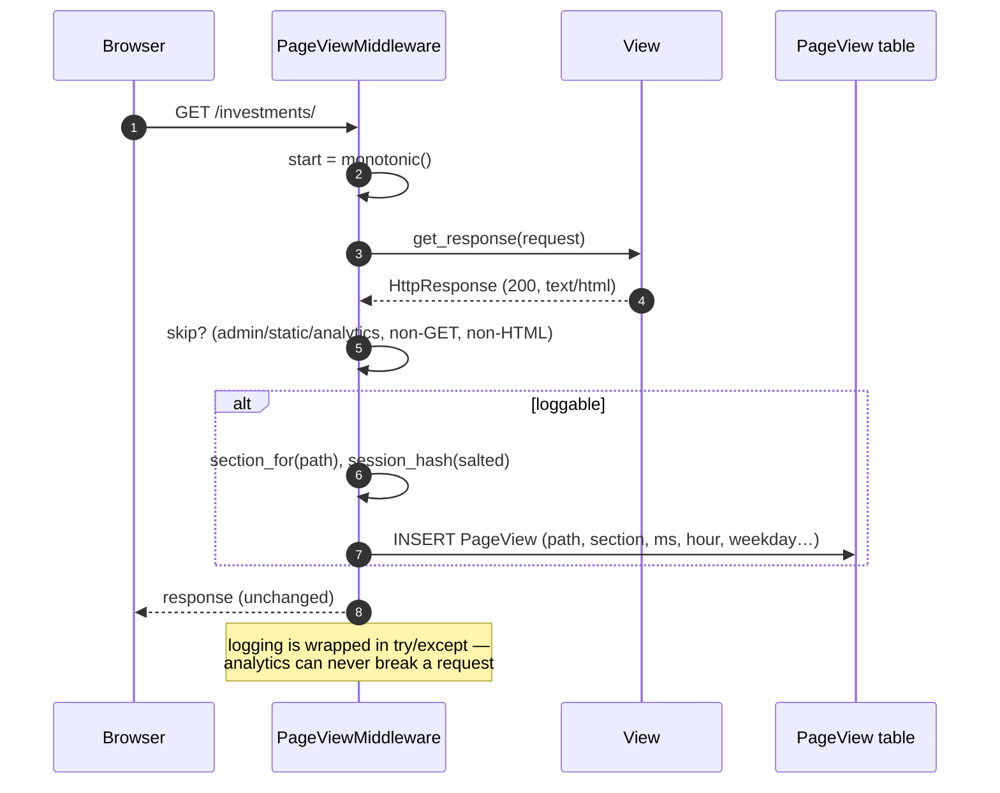
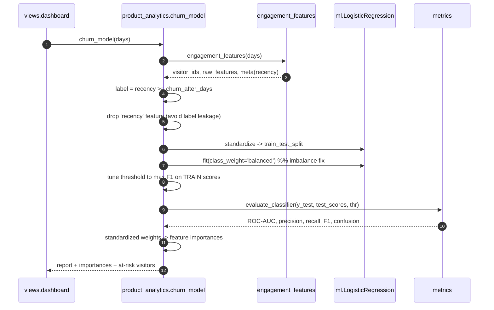
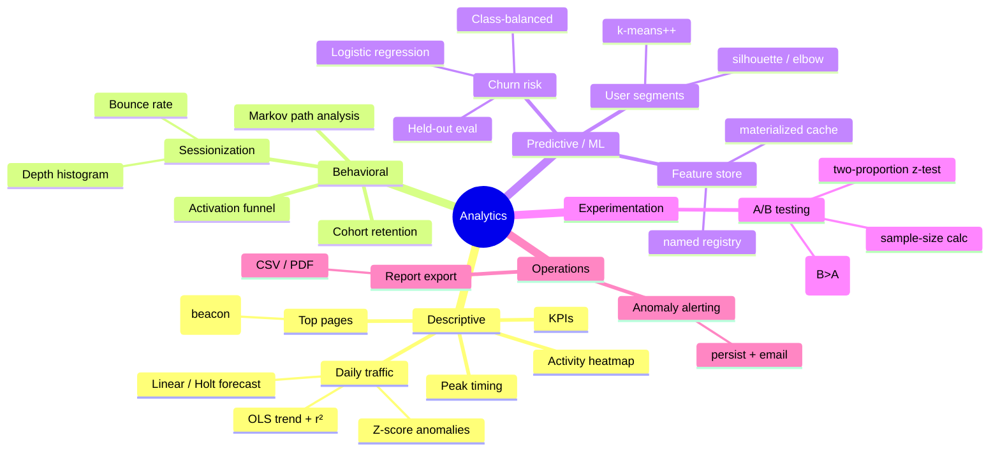

# Emvera Analytics & ML — Architecture & UML

This document describes the `analytics` app: how user activity is captured,
how the pure-Python ML toolkit turns it into intuition, and how it all reaches
the staff dashboard. All diagrams are [Mermaid](https://mermaid.js.org/) and
render directly on GitHub.

> **Design ethos.** Everything here is dependency-free (no numpy/sklearn) so it
> runs offline and the math is auditable. Each algorithm is implemented from
> first principles in `analytics/ml.py` and `analytics/metrics.py`, and unit-
> tested against closed-form answers.

---

## 1. Component overview

How the pieces fit together, from an HTTP request to a rendered insight.



---

## 2. Data model (ER)

A single denormalized event table backs every insight. Time parts are
pre-extracted at write time so grouping is a cheap `GROUP BY`.



**Privacy note.** Anonymous visitors are identified only by
`sha256(SECRET_KEY + session_key)`. That is stable enough to count distinct
visitors and build per-visitor features, but is non-reversible and stores no IP
or raw session id.

---

## 3. ML toolkit (class diagram)

The reusable, hand-rolled algorithms. Dataclasses carry fitted parameters;
free functions do the stateless work.



### Evaluation suite (`metrics.py`)



---

## 4. Request logging (sequence)

What happens on every viewer request.



---

## 5. Churn model pipeline (sequence)

The end-to-end flow that produces the dashboard's Churn Risk panel — including
the ML best-practices that make it trustworthy.



Key best-practices encoded above:

| Concern | Mitigation in code |
| --- | --- |
| **Label leakage** | `recency` defines the label, so it is removed from the feature inputs. |
| **Class imbalance** (few churners) | `class_weight='balanced'` + F1-tuned decision threshold. |
| **Optimistic scoring** | Metrics are computed on a held-out test split, never the training rows. |
| **Threshold-independent quality** | ROC-AUC reported alongside precision/recall/F1. |
| **Interpretability** | Standardized coefficients surfaced as signed feature importances. |
| **Reproducibility** | Fixed seeds in split, k-means++, and the seeder. |

---

## 6. Insight catalog

What each dashboard section answers, and the technique behind it.



---

## 7. Where to look in the code

| Concern | File |
| --- | --- |
| Event capture + dwell token | `analytics/middleware.py` |
| Event schema + models | `analytics/models.py` |
| ML fundamentals | `analytics/ml.py` |
| Model evaluation | `analytics/metrics.py` |
| Feature store | `analytics/features.py` |
| Descriptive insights | `analytics/insights.py` |
| Behavioral / predictive | `analytics/product_analytics.py` |
| A/B statistics | `analytics/ab_test.py` |
| A/B runtime | `analytics/experiments.py` |
| Report export (CSV/PDF) | `analytics/reporting.py` |
| Dashboard + beacon + export views | `analytics/views.py` |
| Dashboard UI | `analytics/templates/analytics/dashboard.html` |
| Demo data | `management/commands/seed_analytics.py` |
| Anomaly alerting (cron) | `management/commands/check_anomalies.py` |
| Feature materialization (cron) | `management/commands/materialize_features.py` |
| Tests | `analytics/tests*.py` (8 modules, 81 cases) |

Run the demo locally:

```bash
python manage.py migrate
python manage.py seed_analytics --days 45 --visitors 90
python manage.py createsuperuser   # so you can reach /analytics/ (is_staff)
python manage.py runserver
# visit http://127.0.0.1:8000/analytics/
```
