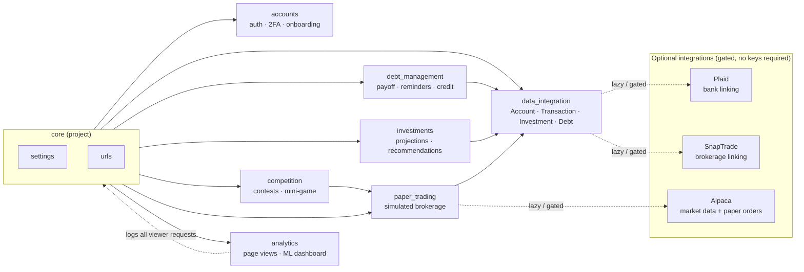
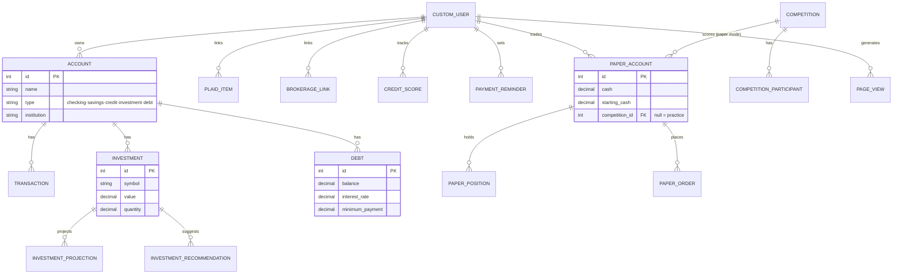
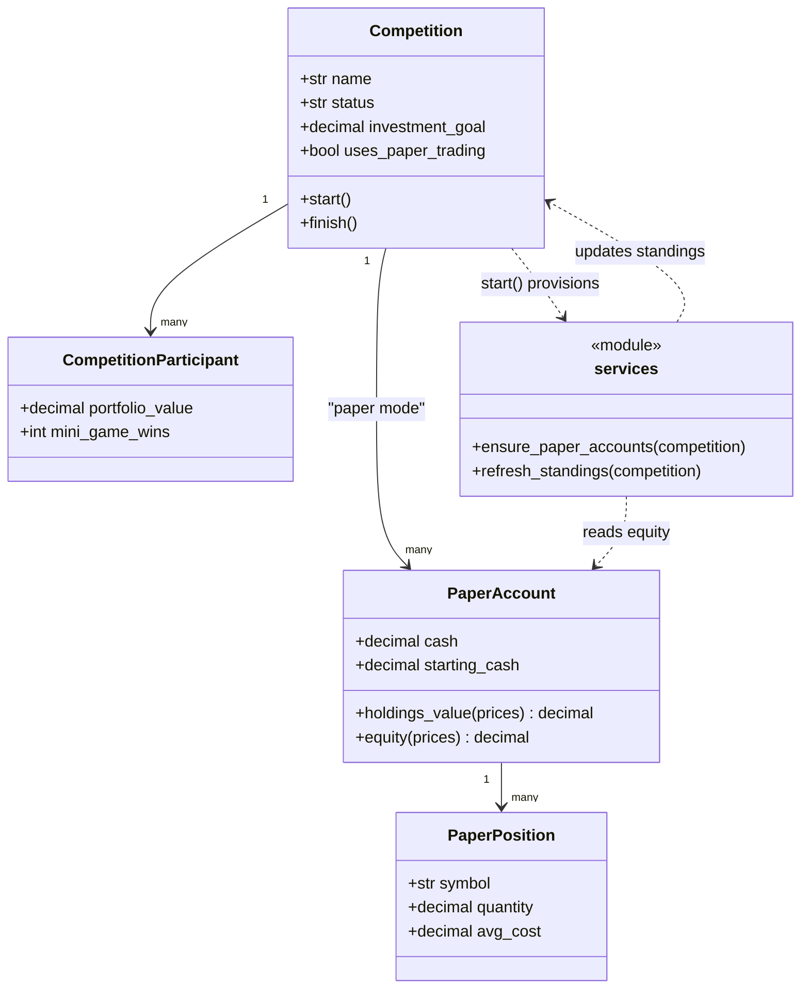
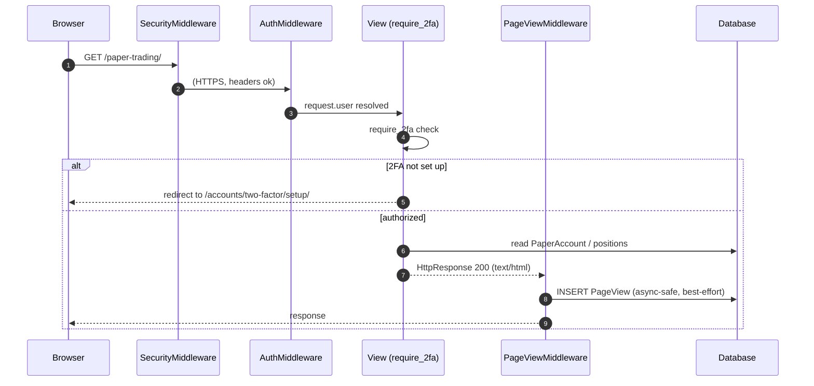
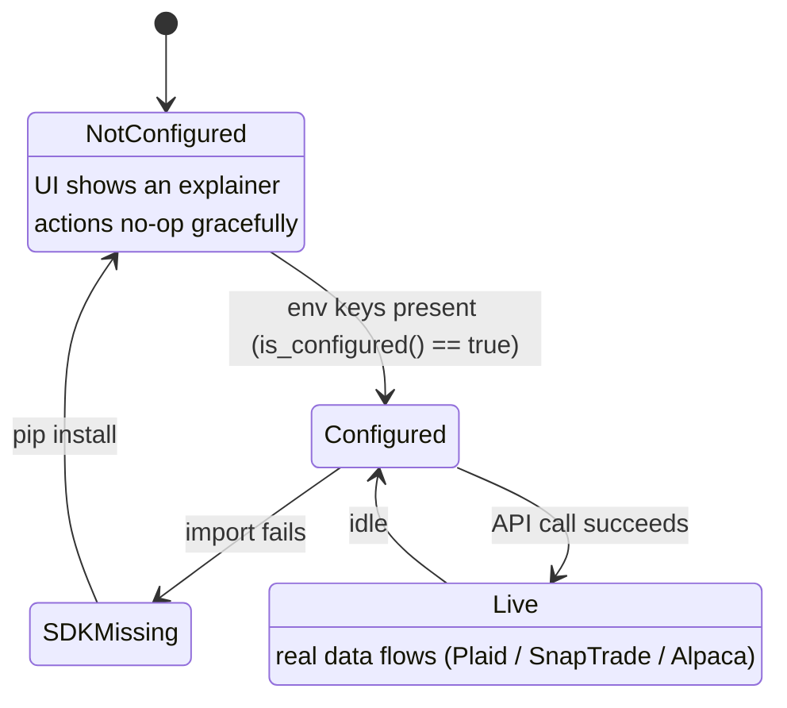

# Emvera — System Architecture & UML

A whole-application view: the Django apps, their domain models, the request
lifecycle, and the optional third-party integrations. Companion to
[analytics-architecture.md](analytics-architecture.md), which drills into the
analytics/ML subsystem. All diagrams are Mermaid and render on GitHub.

---

## 1. App / component map

Emvera is one Django project (`core`) composed of focused apps. `data_integration`
owns the canonical financial models; feature apps build on top.

---

## 2. Domain model (ER)

The core financial entities and the apps that extend them.

---

## 3. Domain logic (class diagram — competition × paper trading)

How a competition optionally rides on the paper-trading engine.

---

## 4. Request lifecycle (sequence)

A typical authenticated, 2FA-gated page request — including analytics logging.

---

## 5. Optional integration gating (state)

Every third-party integration follows the same safe lifecycle: it is inert
until configured, so the app and tests run with zero keys.

---

## 6. App responsibilities

| App | Owns | Depends on |
| --- | --- | --- |
| `accounts` | CustomUser, auth, 2FA, onboarding | — |
| `data_integration` | Account/Transaction/Investment/Debt, Plaid, SnapTrade, CSV, crypto | accounts |
| `debt_management` | payoff math, reminders, credit score | data_integration |
| `investments` | projections, recommendations, performance | data_integration |
| `competition` | contests, mini-game, paper-mode wiring | paper_trading |
| `paper_trading` | simulated brokerage (accounts/positions/orders) | data_integration, Alpaca |
| `analytics` | page-view capture, ML insights dashboard | all (observes), accounts (is_staff) |

See each app's module docstrings for the detailed rationale, and
[analytics-architecture.md](analytics-architecture.md) for the ML internals.
